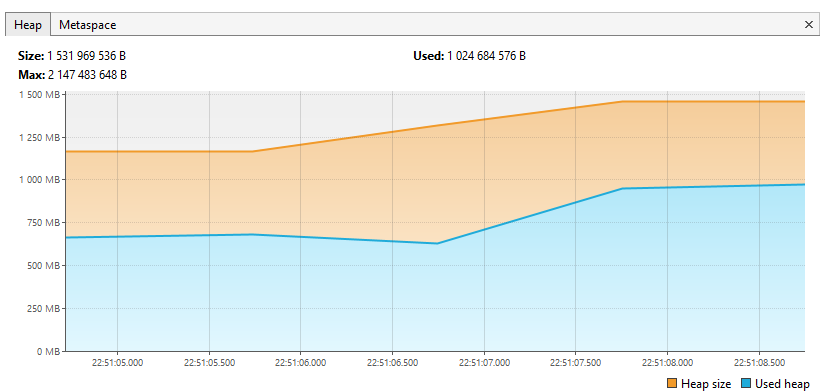
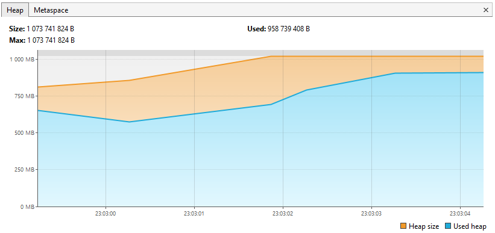

# Тестовое задание на позицию Java Junior Developer в Uno-Soft

## Исполнитель
**Александр Александрович Старков**, [GitHub профиль](https://github.com/StarkovAleksandr1992).

## Описание задачи
Задача описана [здесь](https://github.com/PeacockTeam/new-job/blob/master/lng-java.md) и связана с обработкой разрозненных наборов данных.
Для её решения необходимо использовать систему непересекающихся множеств. Эффективную обработку данных можно обеспечить с помощью Stream API в Java.

### Порядок решения
1. На первом этапе данные из тестового файла обрабатывались как строки. Например, строка "79942968583" в Java представлена объектом класса `String`. Внутри строки хранится массив символов (`char[]`), где каждый символ занимает 2 байта (16 бит). Для строки из 11 символов это даёт 22 байта памяти, только для хранения символов. Это привело к значительному потреблению памяти:

   <p align="center">
       
   </p>

2. Для оптимизации была применена конвертация строк в значения типа `Long`. Переменная типа `long` занимает всего 8 байт, что почти в 3 раза экономичнее, чем строковое представление из 11 символов. Это значительно снизило потребление памяти:

   <p align="center">
       
   </p>

## Репозиторий
Исходный код задания доступен в [GitHub репозитории](https://github.com/StarkovAleksandr1992/test-task-uno-soft).

## Запуск программы
Для запуска программы используйте следующие команду:

```bash
mvn clean package
```
```bash
cd target
```
```bash
java -Xmx1G -jar uno-soft-task.jar test-file.txt
```

## Дополнительные материалы
- [Теория непересекающихся множеств](https://ru.wikipedia.org/wiki/%D0%9D%D0%B5%D0%BF%D0%B5%D1%80%D0%B5%D1%81%D0%B5%D0%BA%D0%B0%D1%8E%D1%89%D0%B8%D0%B5%D1%81%D1%8F_%D0%BC%D0%BD%D0%BE%D0%B6%D0%B5%D1%81%D1%82%D0%B2%D0%B0)
- [Система непересекающихся множеств](https://ru.wikipedia.org/wiki/%D0%A1%D0%B8%D1%81%D1%82%D0%B5%D0%BC%D0%B0_%D0%BD%D0%B5%D0%BF%D0%B5%D1%80%D0%B5%D1%81%D0%B5%D0%BA%D0%B0%D1%8E%D1%89%D0%B8%D1%85%D1%81%D1%8F_%D0%BC%D0%BD%D0%BE%D0%B6%D0%B5%D1%81%D1%82%D0%B2)
- [Применение системы непересекающихся множеств](https://habr.com/ru/articles/104772/)